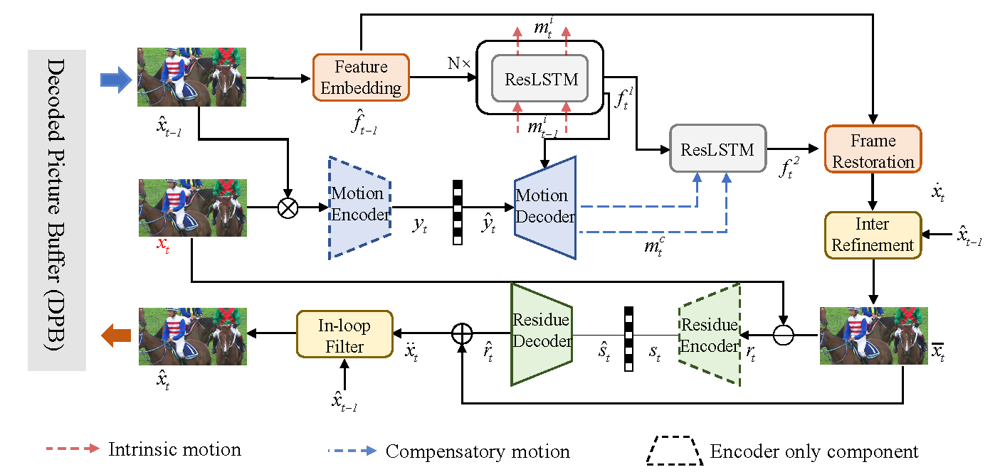

# DMVC: Decomposed Motion Modeling for Learned Video Compression
Pytorch implementation of the paper "DMVC: Decpomsed Motion Modeling for Learned Video Compression". T-CSVT 2022.


## Requirements

- Python==3.7
- PyTorch==1.11

## About
This repository defines a learned video compression framework with decomposed motion modeling for low delay coding scenario. The past reconstructions from DPB are used to capture the intrinsic motion at the first place. The intrinsic motion is conveyed along the temporal axis and takes part in the initial temporal transition. Subsequently, the compensatory motion is unsupervisedly learned conditioned on the approximated feature, so as to refine the temporal transition. The core temporal transition is occurred in the feature space.  The left pixel-level residue between $\bar{x}_t$ and $x_t$ is signaled to derive the reconstruction, which is enhanced by the in-loop filtering module at the last step. 





## Data Preparation

### Training Dataset

- [Vimeo-90k dataset](http://toflow.csail.mit.edu/)

### Test Dataset

This method focuses on the P-frame compression. In terms of I frames, we apply CompressAI to compress them. The test datasets include: 
-  HEVC common test sequences 
- [UVG dataset](http://ultravideo.cs.tut.fi/#testsequences_x) (1080p/8bit/YUV) 
- [MCLJCV dataset](http://mcl.usc.edu/mcl-jcv-dataset/) (1080p/8bit/YUV)

Basically, the test sequences are cropped. After that, both the width and height are the multiplier of 64. Subsequently, we split them into consecutive pictures by ffmpeg. Taking UVG as example, the data process is shown as follows. 

1. Crop Videos from 1920x1080 to 1920x1024.
    ```
    ffmpeg -pix_fmt yuv420p  -s 1920x1080 -i ./videos/xxxx.yuv -vf crop=1920:1024:0:0 ./videos_crop/xxxx.yuv
    ```
2. Convert YUV files to images.
    ```
    ffmpg -s 1920x1024 -pix_fmt yuv420p -i ./videos_crop/xxxx.yuv ./images_crop/xxxx/im%d.png
    ```

## Evaluation
We respectively train four differnt models for PSNR metric, where $\lambda$ equals to 256, 512, 1024 and 2048. As for MS-SSIM metric, we set $\lambda$ as 8, 16, 32 and 64. Our pretrained models are provided on [Google Drive](https://drive.google.com/drive/folders/16Ga9GRgydm1IIj6TNuP2xlxWrxZlD839?usp=sharing). 

    python eval.py --eval_lambda 256 --metric mse --intra_model cheng2020_anchor --test_class ClassD --gop_size 10 --pretrain ./checkpoints/dmvc_psnr_256.model

    python eval.py --eval_lambda 256 --metric ms-ssim --intra_model cheng2020_anchor --test_class ClassD --gop_size 10 --pretrain ./checkpoints/dmvc_msssim_8.model


## Citation
If you find this paper useful, please cite:
```
@inproceedings{lin2022decomposed,
  title={DMVC: Decomposed Motion Modeling for Learned Video Compression}
  author={Lin Kai, Jia Chuanmin, Zhang Xinfeng, Wang Shanshe, Ma Siwei and Gao Wen}
  year={2022}
}
```

## Related links
 * CompressAI: https://github.com/InterDigitalInc/CompressAI
 * Benchmark: https://github.com/ZhihaoHu/PyTorchVideoCompression
 * OpenDVC: https://github.com/RenYang-home/OpenDVC
 * DCVC: https://github.com/DeepMC-DCVC/DCVC
 * M-LVC: https://github.com/JianpingLin/M-LVC_CVPR2020
 * RLVC: https://github.com/RenYang-home/RLVC
